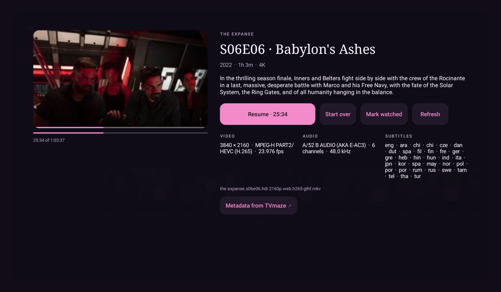
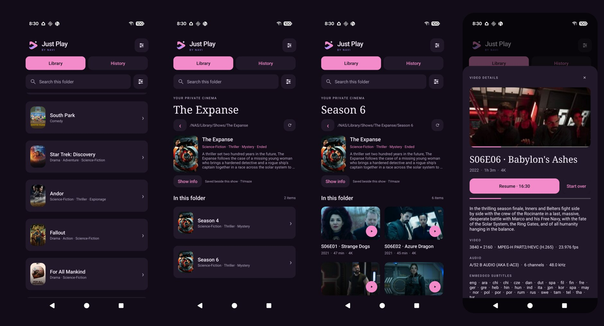
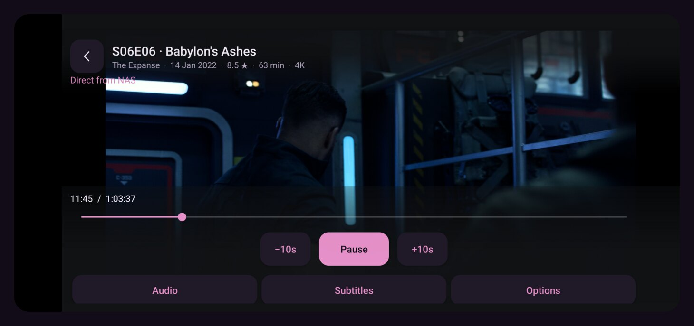
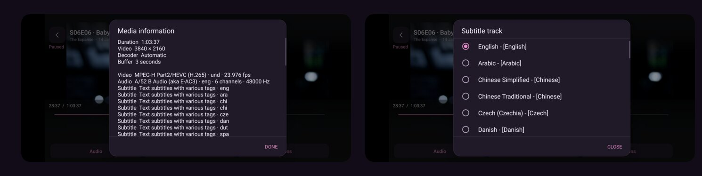
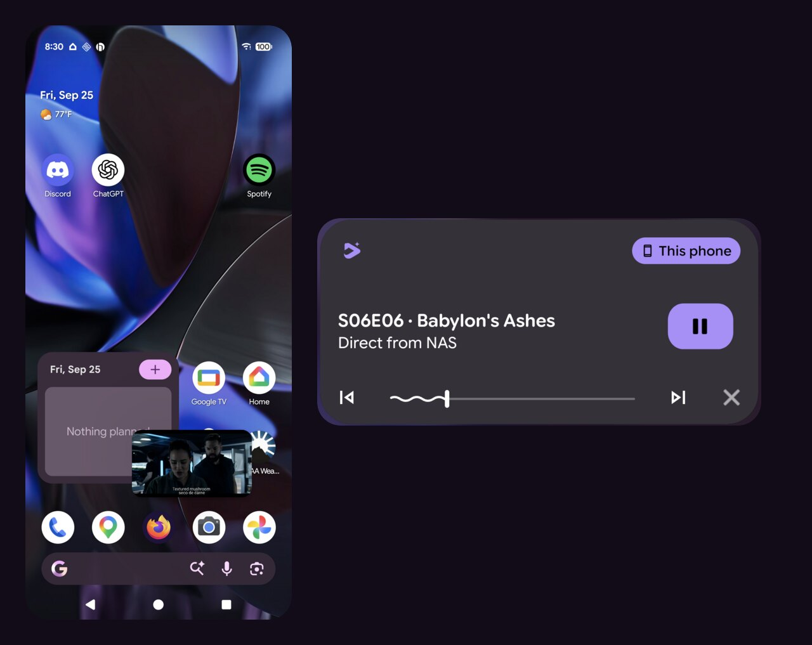
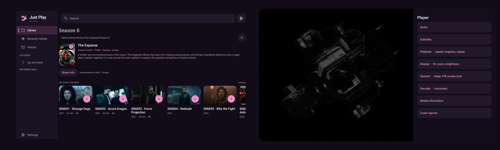
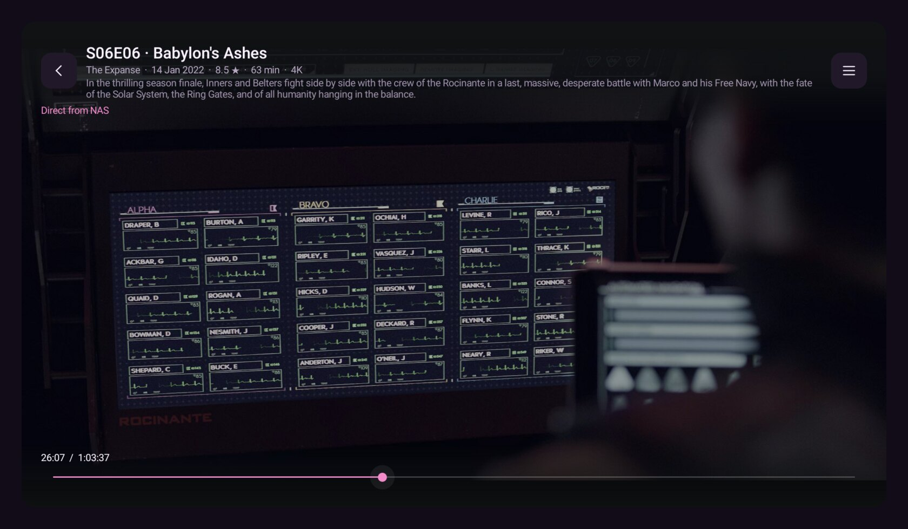
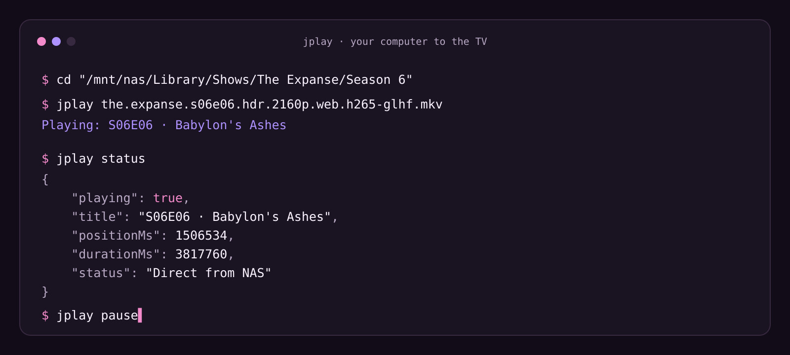

<p align="center">
  
</p>

<p align="center">
  <b>Your NAS, streamed straight to your phone and TV.</b><br>
  No server, no transcoding, no cloud account. Just SMB over Wi-Fi and LibVLC.
</p>

<p align="center">
  
</p>

Just Play is an Android and Android TV video player for media on a Samba share. It
reads files directly from the NAS as it plays: a 7 GB 4K HDR HEVC episode starts in
seconds, with no desktop proxy, transcoding service or full-file download in between.
TV folders are matched against [TVmaze](https://www.tvmaze.com/api), so a pile of
release filenames turns into titled episodes with artwork. That metadata is saved
beside the show on the NAS for every other device to reuse.

- **Streams directly from SMB** with LibVLC 3.7.6, hardware decoding and a software fallback.
- **Show metadata that belongs to you.** TVmaze matches are cached in `.justplay/` beside each show, not in an account.
- **Real frame previews** for everything without official artwork, generated in the background while you browse.
- **A full player**: tracks, external subtitles, delays, equalizer, speed, chapters, zoom and crop, sleep timer, PiP.
- **Phone and Android TV** from one APK, with a D-pad-first TV layout.
- **Remote control from your computer**: send a NAS file, a local file or a YouTube link to the TV.

Android 8.0 or newer. The default build targets ARM64 phones. Add `armeabi-v7a` for
most TVs (see [Build](#build)).

## On the phone

<p align="center">
  
</p>

Browse the share as folders of cards. Show folders pick up their poster, genres and
synopsis. Season folders list episodes by aired number and name, since `S01E04` and
`1x04` filenames are matched to the TVmaze catalogue. Tap a card for details:
stream info, embedded subtitle languages, and resume or start over. **History** keeps
everything you have watched, and positions survive upgrades.

When a title has no unique exact match, **Match show** lets you pick it, and **Show
info → Change match** corrects it later. The selected match, show details, episode
catalogue and images are written to `.justplay/` beside the show using atomic renames,
then read back before success is reported. Your video files and third-party sidecars
are never modified. Only the show's search title or ID is sent to TVmaze.

## The player

<p align="center">
  
</p>
<p align="center">
  
</p>

Controls are grouped into **Audio**, **Subtitles** and **Options**: track selection,
external subtitle files from the phone's document picker, per-video audio and subtitle
delays, equalizer presets, speed, chapters, go-to-time, ten-second skips, aspect ratio,
fit/crop/stretch, zoom, brightness, repeat, sleep timer, screen lock and rotation. Track
choices and timing offsets are remembered per video. **Media information** shows the
codecs, streams and decoder in use. Buffering defaults to three seconds and can be set
from one to fifteen.

<p align="center">
  
</p>

Playback belongs to a foreground media service, so it keeps going when you leave the app.
**Home** enters picture in picture, and **Back** returns to the library with a **Now
playing** bar. The notification and lock screen share the same session, including skips
and Stop. Headphone disconnects and audio-focus loss pause playback as expected.

## On the TV

<p align="center">
  
</p>

On Android TV the library gets a side tray (Library, Recently Added, History and the
current folder's subfolders) and cards sized for the couch. Every screen is D-pad
reachable. In the player, the menu key opens a side panel with the same options as on
the phone. The remote's media keys scrub with an accelerating step.

<p align="center">
  
</p>

## Play it from your computer

<p align="center">
  
</p>

`remote/jplay` tells a device running Just Play what to play:

```sh
jplay "/mnt/nas/Library/Shows/The Expanse/Season 6/the.expanse.s06e06.hdr.2160p.web.h265-glhf.mkv"
jplay https://youtu.be/<id>          # YouTube, via a yt-dlp streamer on this machine
jplay ~/Videos/clip.mkv              # a local file, served once to that device
jplay status | pause | resume | toggle | stop
jplay --host <phone-ip> --start 90 <file>
```

A file on a mounted SMB share is sent as the `smb://` URI the app already streams. Any
other local file is served by `remote/serve.php` behind a single-use, unguessable token
that only the target device may fetch. YouTube links go to `remote/ytstream.py`, which
uses yt-dlp to resolve separate seekable video and audio streams. It relays them in
10 MB ranges and re-extracts when an upstream URL expires. That needs
[bgutil-ytdlp-pot-provider](https://github.com/Brainicism/bgutil-ytdlp-pot-provider)
for proof-of-origin tokens.

The app's side is a tiny HTTP API on port 8791:

```
POST /play    url=<smb:// or http(s) or YouTube link> [&start=<seconds>] [&title=...]
GET  /status
POST /pause  /resume  /toggle  /stop
```

It answers exactly one computer, the **controller**. Connections from any other address
are closed before a byte is read. With no controller set, the API is off.

## Configuration

Local settings live in `.env`, which git ignores. Copy `.env.example` and fill in what
you use. Values already in the environment take precedence.

| Variable | Used by | Meaning |
| --- | --- | --- |
| `JPLAY_CONTROLLER` | build | IP of the computer allowed to control the app. Blank ships with the remote API off. It can also be changed in **Library settings → Remote control**. |
| `JPLAY_TARGET` | `jplay` | Default device to send to, usually the TV. `--host` overrides it. |
| `JPLAY_BGUTIL` | `jplay` | Path to bgutil's `server/build/main.js`. Needed only for YouTube. |
| `JPLAY_STREAM_ALLOW` | `ytstream.py` | Comma-separated CIDRs the YouTube streamer answers. Default: private ranges. |
| `JPLAY_PHONE_SERIAL`, `JPLAY_NAS_HOST`, `JPLAY_NAS_SHARE`, `JPLAY_NAS_FOLDER`, `JPLAY_NAS_CREDENTIALS` | `provision-phone.py` | Defaults for debug-build login provisioning. |

## Build

The build uses the Android SDK directly (platform and build-tools 34, any JDK that
targets Java 8), without an IDE or Gradle daemon:

```sh
cp .env.example .env                               # optional: set JPLAY_CONTROLLER
./build.sh release                                 # ARM64 phones
JPLAY_ABIS='arm64-v8a armeabi-v7a' ./build.sh release   # phones and most TVs
adb install -r build/jplay-release.apk
```

The script downloads the pinned LibVLC and SMB dependencies, verifies them against
`dependencies.sha256` and packages LibVLC's native libraries unmodified. Set
`ANDROID_HOME` and `JPLAY_JAVA_HOME` for non-default installs. A standard Android Gradle
project (AGP 8.5.2, Gradle 8.7, JDK 17) is included for Android Studio. It reads the
same `.env`, but on-device verification has used `build.sh`.

The first build creates `build/jplay.keystore` and reuses it after that. Back it up to
keep updating an installed copy without losing its data. It is a local development
identity with a conventional password, not a distribution signing setup.

For a trusted development session, `./build.sh debug` plus `scripts/provision-phone.py`
can import a NAS login from a Samba credentials file. The login travels over ADB stdin,
never through arguments or logs, and the app encrypts it on first launch. Install the
release build over it afterwards with the same key. The data survives and `run-as` is
disabled again.

## Privacy and limits

- The NAS login is encrypted with AES-GCM under an Android Keystore key. Backup is disabled.
- Metadata, thumbnails and watch history stay on the device and your NAS. Nothing else leaves the LAN except TVmaze title lookups.
- The app binds to Wi-Fi. If Wi-Fi drops, streaming stops; reconnect and tap **Retry**.
- One NAS profile per device. Clearing app data removes the login, history and options.
- **Crash reports** (Library settings) queue locally and upload to `JPlay/Crashes` on your share. They exclude credentials, media names, log buffers and memory contents.
- Playback is bounded by LibVLC, codecs, HDR output support, DRM and your Wi-Fi throughput. Combined episodes, absolute numbering and DVD orders keep their filename or embedded titles for now.

## Layout

| Path | What it is |
| --- | --- |
| `app/src/main/java/in/akuj/jplay/` | The app. `MainActivity`, `Ui` and `ArtworkView` handle the library; `PlayerActivity` and `PlaybackService` the player; `ShowMetadata` and `NasSidecar` TVmaze and `.justplay/`; `LibraryStore` and `LibraryIndexer` the catalogue and previews; `RemoteApi` and `RemoteService` the controller API; `Profile` the encrypted login; `CrashReports` and `NasUploader` crash reporting. |
| `remote/` | `jplay` CLI, `serve.php` local-file server, `ytstream.py` YouTube streamer. |
| `scripts/provision-phone.py` | Debug-only login provisioning over ADB. |
| `design/brand/` | Logo, icon and brand board sources. |
| `docs/screenshots/` | Images used in this README. |
| `docs/dev-notes/` | Historical coordination and verification logs from development. |

The project has no automated test suite. Changes are verified by building and by
playing from a real NAS on a phone and an Android TV.

## Credits

Playback is [VideoLAN LibVLC](https://code.videolan.org/videolan/libvlcjni) under
LGPL-2.1-or-later. NAS writes use [SMBJ](https://github.com/hierynomus/smbj). Show
metadata comes from [TVmaze](https://www.tvmaze.com/) under
[CC BY-SA 4.0](https://creativecommons.org/licenses/by-sa/4.0/) and is attributed in the
app. See [THIRD_PARTY.md](THIRD_PARTY.md) for versions and sources. Just Play is not
affiliated with VideoLAN or TVmaze.

The folded play-ribbon mark and brand are original work by Navi, in pink, violet and
warm white on dark ink.
